# TSIKT - Semestralne Zadanie

---
by Artem Ponomarov
## 1. What is this project?

This is a **task management app** where you can:
- Register and login
- Create groups for your projects
- Add tasks with deadlines
- Track task status (Open → In Progress → Done)
- Chat with team members
- Share files/materials
  - See statistics about your progress

**Who is it for?** Students working on group projects, small teams, anyone who needs to organize tasks.

**What problem does it solve?** Keeps everyone on the same page - you can see what tasks exist, who's doing what, and get notified when something changes.

### Tech stack
- Java 25
- JavaFX 21 (for the UI)
- WebSocket (for real-time updates)
- Maven (build tool)

---

## 2. How it works (Architecture)

```
┌─────────────────────┐
│   JavaFX Frontend   │  ← You are here (this project)
│   (Desktop App)     │
└─────────────────────┘
          │
          │ HTTP requests + WebSocket
          ▼
┌─────────────────────┐
│   Spring Boot       │  ← Backend (separate project)
│   Backend           │
└─────────────────────┘
          │
          ▼
┌─────────────────────┐
│     Database        │
└─────────────────────┘
```

**Frontend structure:**
```
src/main/java/com/example/client/
├── Main.java           - starts the app
├── WSClient.java       - WebSocket connection
├── controllers/        - handles button clicks, loads data
├── holders/            - stores current user/group/task info
├── models/             - data classes
└── utils/              - helper functions (validation, etc.)

src/main/resources/com/example/client/
├── *.fxml              - screen layouts
└── styles/dark-theme.css
```

---

## 3. Database

Here's what the database looks like:

```
USERS
- id
- name
- email  
- password

GROUPS
- id
- name
- description
- owner_id → USERS

MEMBERSHIPS (who is in which group)
- user_id → USERS
- group_id → GROUPS

TASKS
- id
- title
- description
- status (OPEN / IN_PROGRESS / DONE)
- deadline
- group_id → GROUPS
- created_by → USERS

MESSAGES (chat)
- id
- content
- group_id → GROUPS
- user_id → USERS

MATERIALS (files)
- id
- name
- url
- group_id → GROUPS
```

---

## 4. API Endpoints

Backend runs on `http://localhost:8080`

### Users
| Method | URL | What it does |
|--------|-----|--------------|
| POST | `/users/register` | Register new user |
| POST | `/users/login` | Login |
| GET | `/users/{id}` | Get user info |
| PUT | `/users/{id}` | Update profile |

### Groups
| Method | URL | What it does |
|--------|-----|--------------|
| GET | `/groups/user/{userId}` | Get user's groups |
| POST | `/groups/create` | Create new group |
| POST | `/groups/{id}/addMember` | Add someone to group |

### Tasks
| Method | URL | What it does |
|--------|-----|--------------|
| GET | `/tasks/group/{groupId}` | Get all tasks in group |
| GET | `/tasks/info/{taskId}` | Get task details |
| POST | `/tasks/create` | Create new task |
| PUT | `/tasks/{id}` | Update task |
| DELETE | `/tasks/{id}` | Delete task |

### Messages
| Method | URL | What it does |
|--------|-----|--------------|
| GET | `/messages/group/{groupId}` | Get chat messages |
| POST | `/messages/send` | Send message |

### Materials
| Method | URL | What it does |
|--------|-----|--------------|
| GET | `/materials/group/{groupId}` | Get files |
| POST | `/materials/upload` | Upload file |

### Statistics
| Method | URL | What it does |
|--------|-----|--------------|
| GET | `/stats/group/{groupId}` | Get task stats |

### WebSocket
Connect to `ws://localhost:8080/ws/notify` to get real-time notifications when:
- New task is created (`task_new`)
- New member joins (`member_new`)
- New file uploaded (`material_new`)
- New chat message (`chat_new`)

---

## 5. Screens

The app has these screens:

1. **Login** - enter email and password 
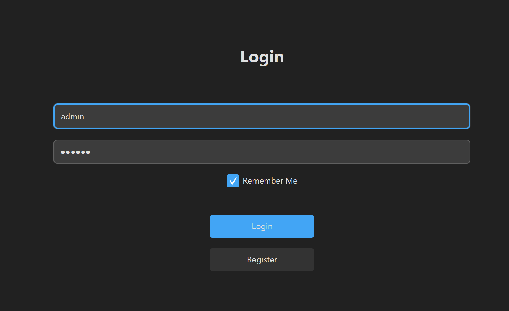
2. **Register** - create new account
   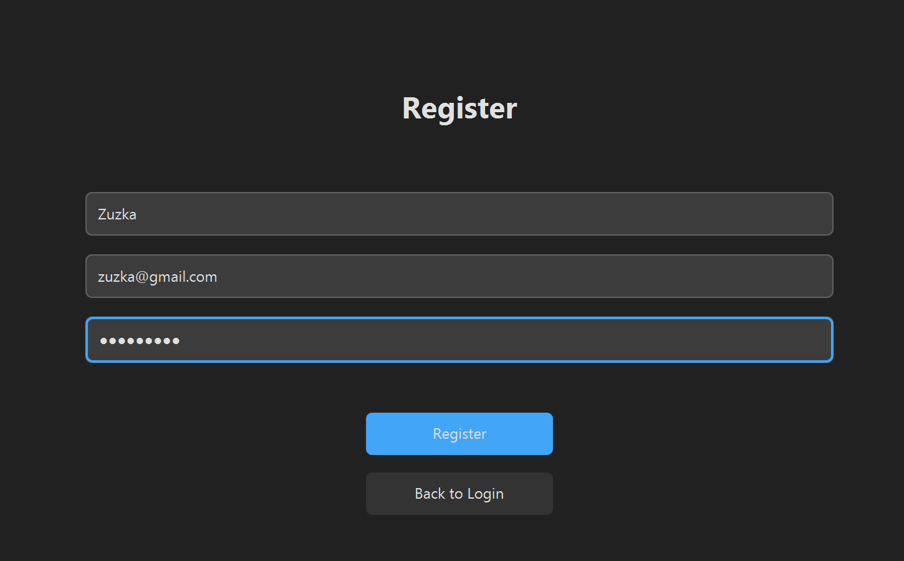
3. **Groups** - list of your groups, create new ones
   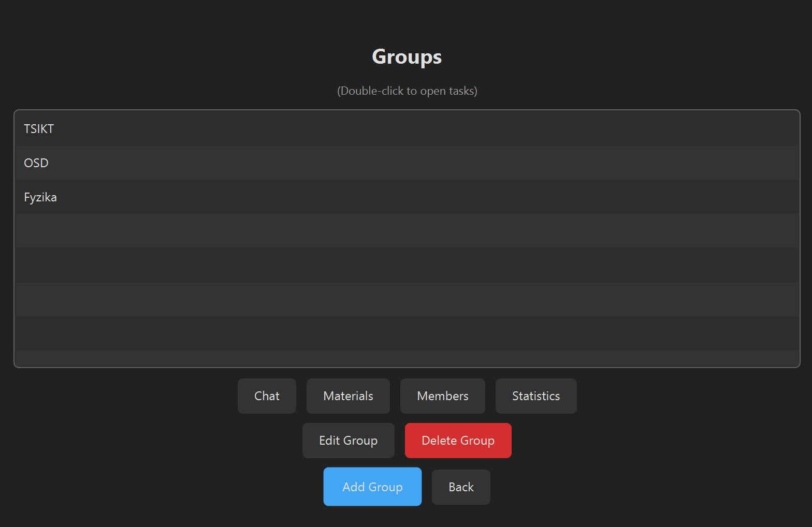
4. **Tasks** - kanban board with 3 columns (Open, In Progress, Done)
   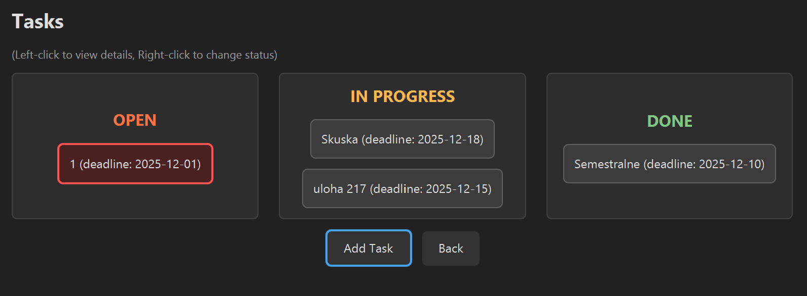
5. **Task Details** - see full task info, mark done, delete
   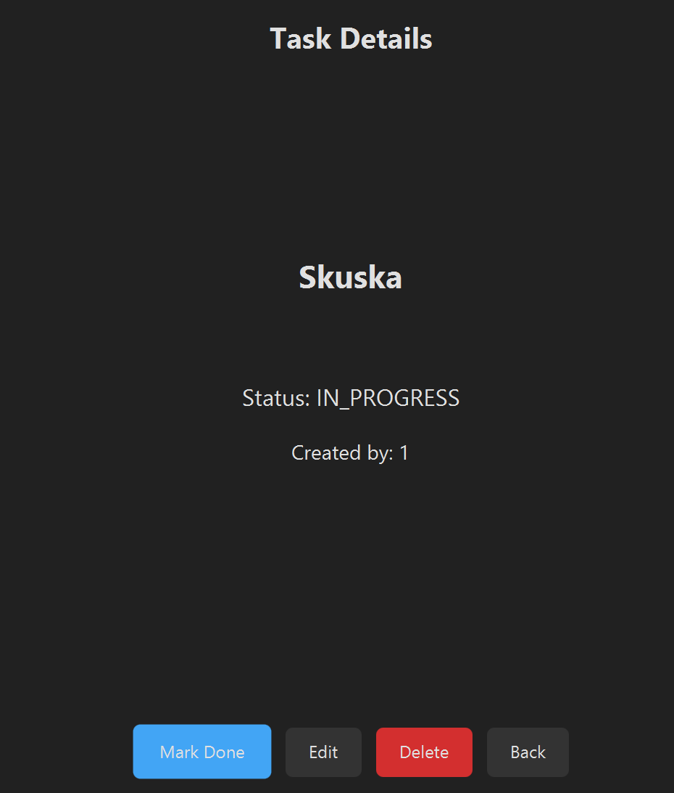
6. **Edit Task** - change task title/description/deadline
   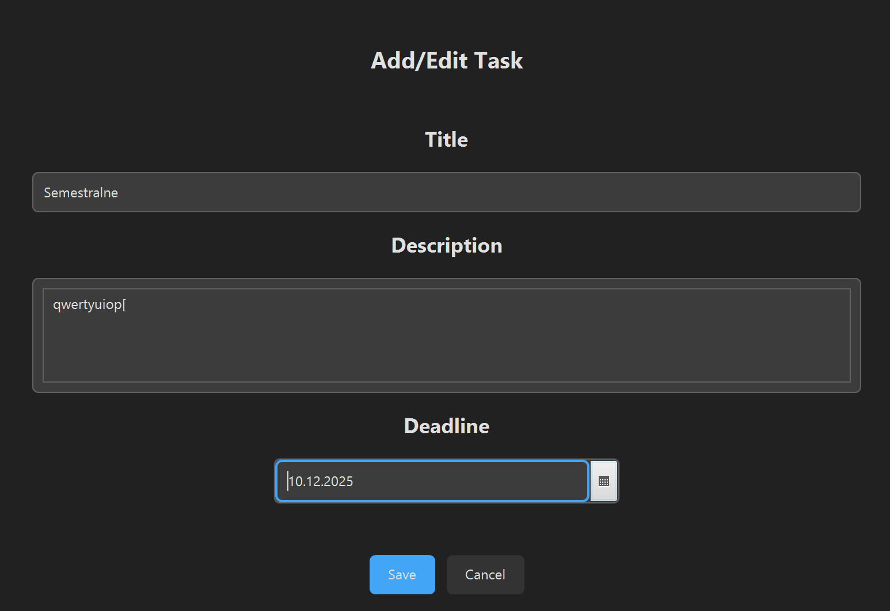
7. **Members** - see who's in the group, add/remove people
   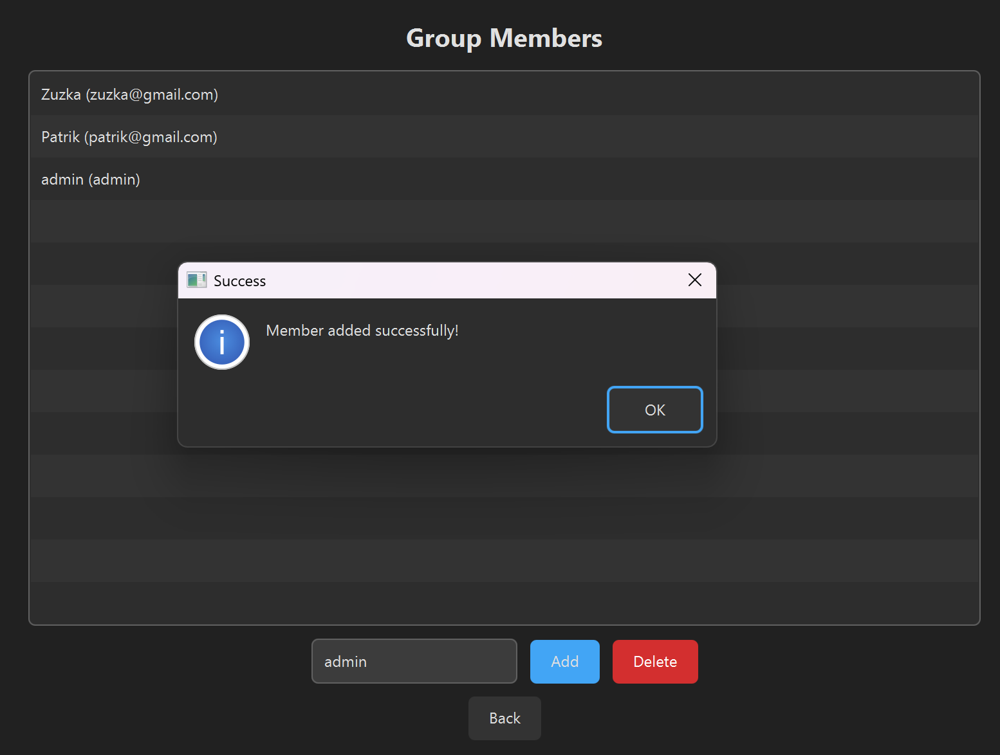
8. **Chat** - send messages to group
   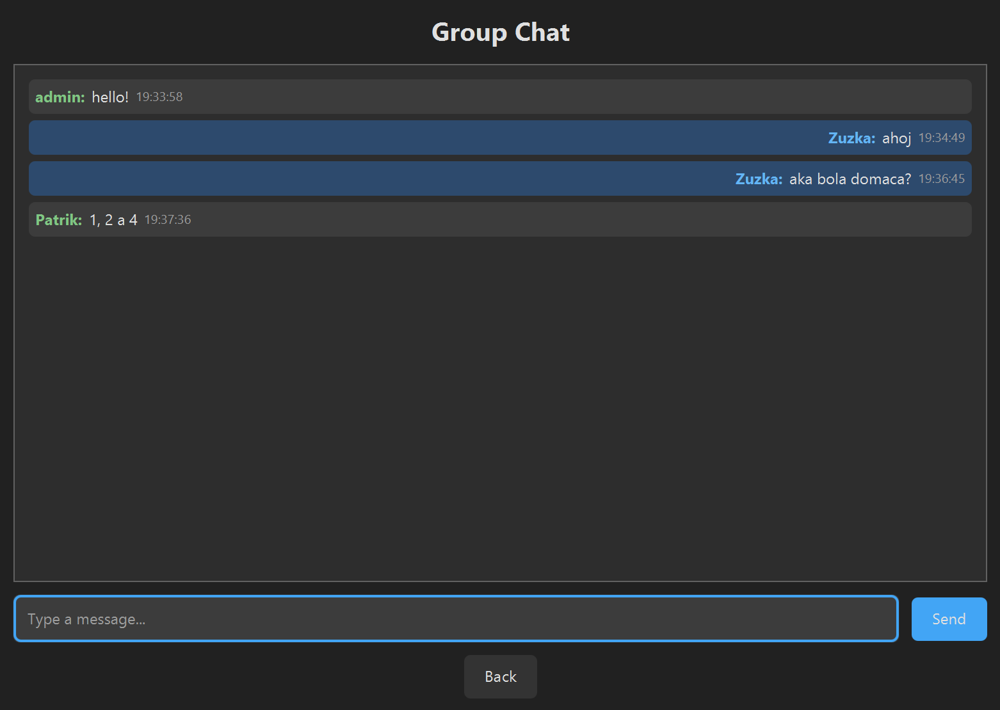
9. **Materials** - upload and view files
   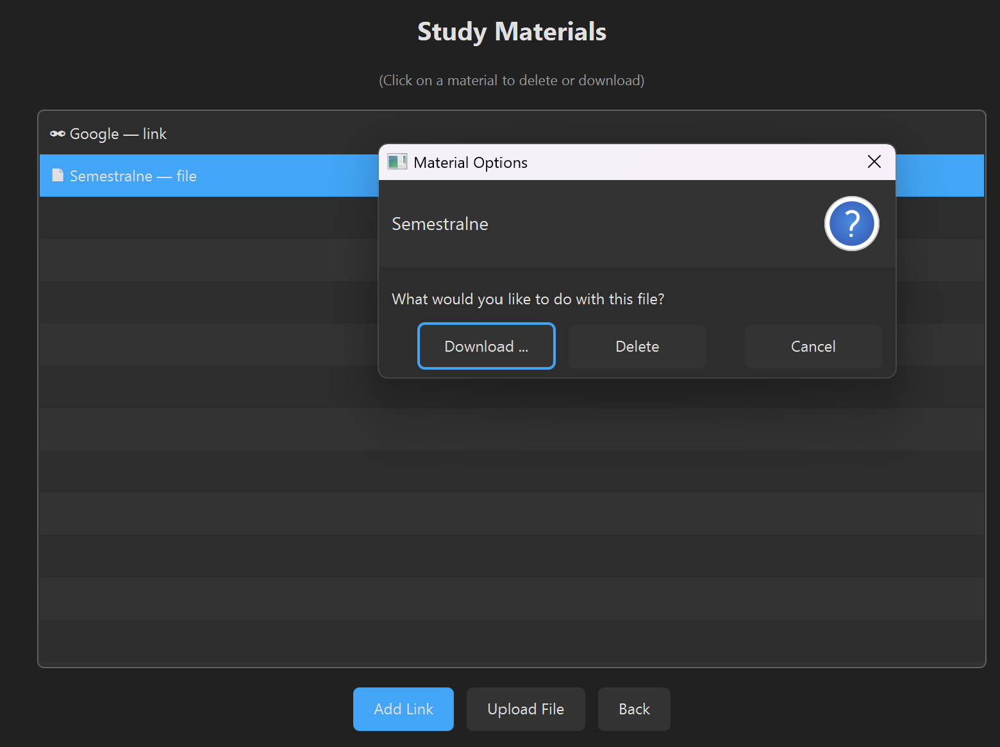
10. **Statistics** - charts showing how many tasks done
    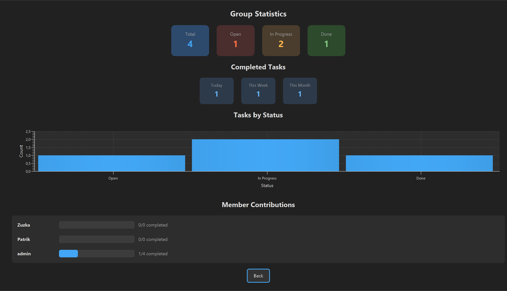
11. **Notifications** - list of recent activity
    
12. **Profile** - edit your name/email
    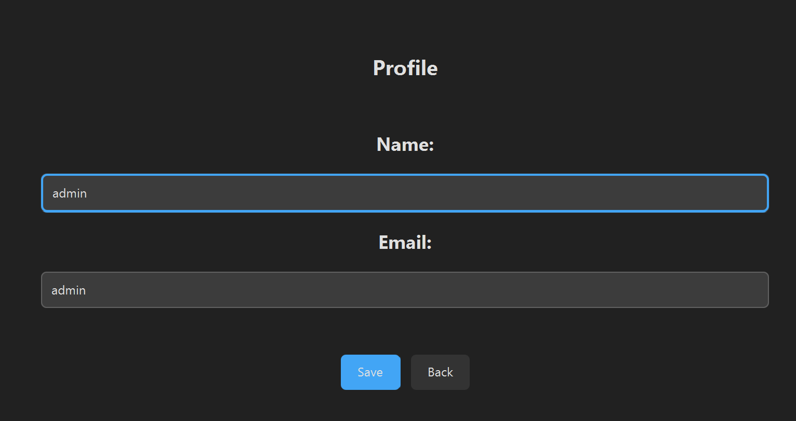

**Flow:**
```
Login → Groups → (pick a group(create if list is empty)) → Tasks → (click task) → Task Details
  [uploads](uploads)                                     ↓
                              Members / Chat / Materials / Stats
```

The app uses a dark theme (dark gray background, light text).

---

## 6. Problems I ran into and how I fixed them

### Problem 1: Input validation
Users could enter empty names or invalid emails.

**Fix:** Created `ValidationUtils` class that checks:
- Email must have `@`
- Password must be at least 6 characters
- Name can't be empty

### Problem 2: Real-time updates
When someone creates a task, others don't see it until they refresh.

**Fix:** Used WebSocket connection. When backend sends a notification, the app automatically refreshes the list.

### Problem 3: Keeping track of current user/group
When you switch screens, the app forgets who you are.

**Fix:** Created `UserHolder` and `TaskHolder` classes with static variables to store current userId, groupId, etc.

### Problem 4: UI updates from WebSocket
WebSocket runs on a different thread, so updating UI directly crashes the app.

**Fix:** Wrapped all UI updates in `Platform.runLater()`:
```java
Platform.runLater(() -> {
    // update UI here
});
```

### Problem 5: Styling dialogs
The built-in dialogs looked ugly with the dark theme.

**Fix:** Created `SceneUtils.styleDialog()` method that applies dark theme CSS to dialogs.

### Problem 6: Showing overdue tasks
Hard to see which tasks are past deadline.

**Fix:** Compare deadline with today's date, if overdue → make text red.

---

## 7. What I used AI for

I used **GitHub Copilot** and **ChatGPT** while working on this project.

### What AI helped with:
- Writing boilerplate code (HTTP requests, FXML controller setup)
- Suggesting how to structure the WebSocket client
- Generating initial CSS styles
- Explaining JavaFX threading issues
- Writing this README

### What I had to do myself:
- Figuring out the actual business logic
- Debugging when things didn't work
- Making the UI look good (colors, spacing)
- Connecting frontend with backend (matching the API format)
- Testing everything

### What I learned:
- AI is good for getting started quickly, but you still need to understand the code
- Always test AI-generated code, it often has small bugs
- AI is really helpful for writing documentation

---

## How to run

1. Make sure backend is running on `localhost:8080`(Run DemoApplication.java)
2. Run:
```bash
mvn javafx:run
```
